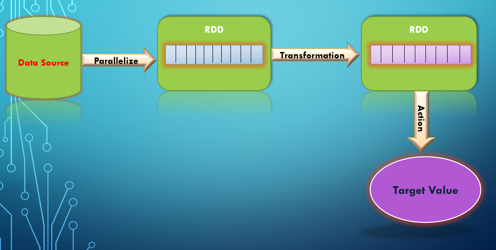

# Cumulative for the  Introduction to RDD
<details><summary>Prerequisites and Learning Objectives</summary>

## Prerequisites 

- Programming experience in Python or Scala. 

## Objectives

- To understand the core concept of RDDs in Spark and its usage.

---

</details>
<details><summary>Description</summary>

## Description

- RDDs are the core of Apache Spark. It stands for Resilient Distributed Datasets. This is a data structure that is present from the initial release of spark. Now along with RDDs, dataframes and Datasets have been introduced in the newer versions of spark that are built on the top of RDD. 

- Anything in Spark you do revolves around the RDD and each RDD is distributed across different nodes of the cluster in the production scenario. RDDs are stored in RAM and not in Hard Disk which makes spark processing faster than any other application. 



## Features of RDD in Spark

- **Immutable:** RDDs are immutable collection of objects, Meaning we cannot change the state of RDD, instead we can create another RDD from its previous RDD by applying different operations. 

- **Resilient:** RDDs are resilient, meaning they provide fault tolerance. Each transformation operation applied on RDDs are stored in lineage graph which helps in recompute any damaged or missing partition because of node failure.

- **Lazy Evaluation:** Transformation operations applied on RDDs are executed only when any action is triggered. These RDDs are not evaluated until any result is needed which makes its evaluation lazy and thus increased the performance of an application.

- **Distributed:** RDD data is being distributed on multiple nodes of a cluster. Which makes its data high available. 

- **Persistence:** Intermediate results of RDD can be reused by users and they can select their storage location as well, either in-memory or in disk, for fast computations. 


## Ways of Creating RDD

- It can be created by using parallelize() method. 
- It can be created from existing RDD. 
- It can be created from external storage like HDFS, Amazon S3, HBase, etc. 
- It can be created from existing Dataframe and Dataset. 

---

</details>
<details><summary>Real World Application</summary>

</details>
<details><summary>Implementation</summary> 

## Implementation(PySpark)

As we already talked about the several ways of creating a RDD in Spark. Let us now see how to create them. 

**1. Creating RDD using `parallelize()` method**

- To create an RDD, first we must import Spark classes.

```
import pyspark
from pyspark import SparkContext, SparkConf
```

- Then create `SparkConf` and `SparkContext` object.

```
conf = SparkConf().setMaster(master).setAppName(app_name)

sc = SparkContext(conf = conf) 

```
**Note:** 
> `setMaster()` and `setAppName()` are the minimum properties required to run spark application.

- Now, we can use parallelize() over collection. A collection is a like a container that holds list of items.

```
data = [10, 20, 30, 40, 50]
rdd = sc.parallelize(data)
``` 
- The work of parallelize() is to distribute data of specified collection on multiple nodes of a cluster so that processing of data would happen in parallel which results in fast outcome. 


**2. Creating RDD from Existing RDD**

- When we apply any transformation operation on existing RDD, then a new RDD has been created. For example, we are going to apply `map()` function on existing RDD "rdd1".
```
rdd1 = sc.parallelize[1, 2, 3] 

rdd2 = rdd1.map(lambda sum: sum+1)
rdd2.collect()
```

- Here, `collect` is an action applied on rdd2 to get all the elements in output screen.

**Note:**
> We will discuss more about RDD operations in Basic-RDD-Operations module. 


**3. Creating RDD from existing Dataframe or Dataset** 

- To convert any Dataframe or Dataset to RDD, simply add `rdd` to it. For Example, let's assume we have a Dataframe as "df" and we want to convert it into RDD. To do so must write...
```
demo_rdd = df.rdd
```

**Note:** 
> In "Data-Load-Store" module, we will be seeing how to create a RDD from referencing a dataset.

---

</details>
<details><summary>Summary</summary> 

## Summary

- RDDs are the fundamental data structure of Spark that is logically partitioned on different nodes of a cluster. Each RDD partition can be stored and processed on different nodes. 

- They are immutable collection of objects that are distributed and fault tolerant in nature. 

- Spark RDDs can be created in different ways, by using parallelize() method, by applying transformation operation on existing RDD, by converting dataframe or dataset using rdd property, etc. 

---

</details>
<details><summary>Practice Questions</summary>

[Practice Questions](./Quiz.gift)</details>
